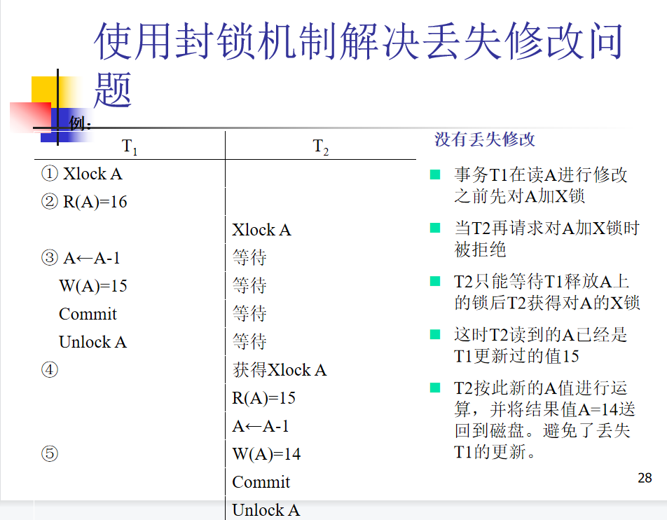
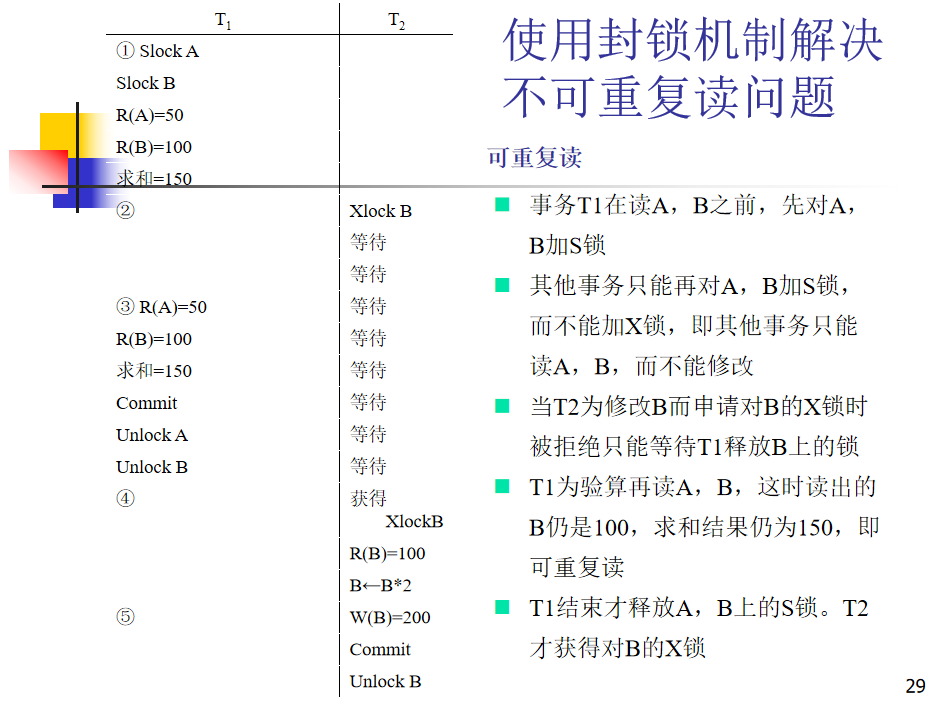
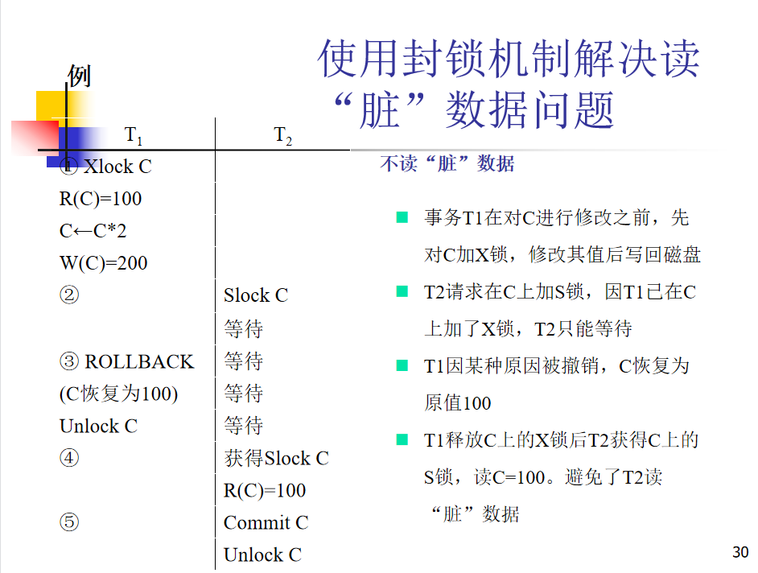

# CH11 并发控制

什么是事务的串行调度？并发调度？
(1)事务串行执行
每个时刻只有一个事务运行，其他事务必须等到这个事务结束以后方能运行
不能充分利用系统资源，发挥数据库共享资源的特点

如果不加以控制，事务的并发调度可能会产生什么问题？
- 丢失修改
	- 两个事务 $T_1$ 和 $T_2$ 读入同一数据并修改，$T_2$ 提交的结果破坏了 $T_1$ 提交的结果，导致 $T_1$ 的修改被丢失。
- 不可重复读
	- 指事务 $T_1$ 读取数据后，事务 $T_2$ 执行更新操作，使 $T_1$ 无法再现前一次读取结果。
- 读脏数据
	- 指事务 $T_1$ 修改某一数据并将其写回磁盘，事务 $T_2$ 读取同一数据后，$T_1$ 由于某种原因被撤销，这时被 $T_1$ 修改过的数据恢复原值， $T_2$ 读到的数据就与数据库中的数据不一致，则 $T_2$ 读到的数据就为脏数据。

简述封锁机制的工作原理；
- 封锁就是事务 $T$ 在对某个数据对象（例如表、记录等）操作之前，先向系统发出请求，对其加锁。
- 加锁后事务 $T$ 就对该数据对象有了一定的控制，在事务T释放它的锁之前，其它的事务不能更新此数据对象。

引入封锁机制，如何解决上述3个问题？

死锁预防
- 一次封锁法
	- 要求每个事务必须一次将所有要使用的数据全部加锁，否则就不能继续执行
	- 存在的问题
		- 降低系统并发度
		- 难于事先精确确定封锁对象
- 顺序封锁法
	- 顺序封锁法是预先对数据对象规定一个封锁顺序，所有事务都按这个顺序实行封锁。
	- 顺序封锁法存在的问题
		- 维护成本：数据库系统中封锁的数据对象极多，并且在不断地变化。
		- 难以实现：很难事先确定每一个事务要封锁哪些对象

死锁诊断
- 

死锁的判别；

冲突操作对；

事务优先图；

等价的串行调度；

2PL协议；

多粒度封锁协议。
